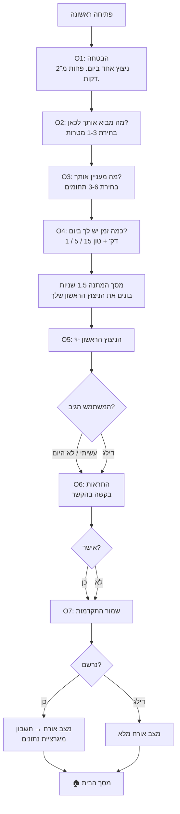
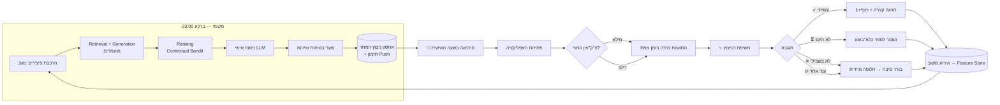
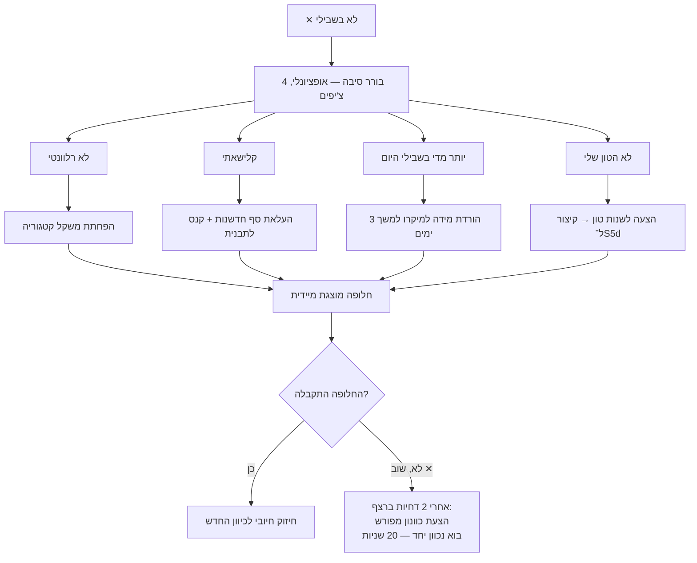
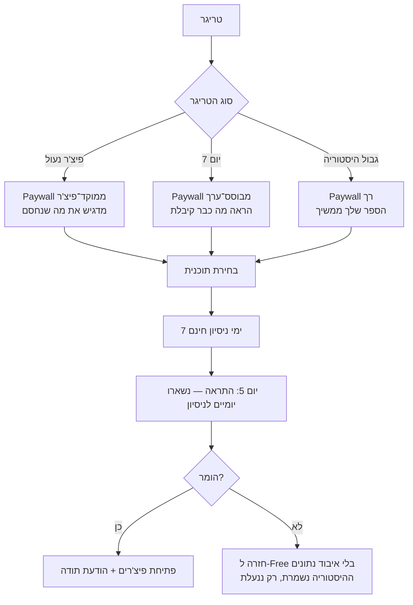
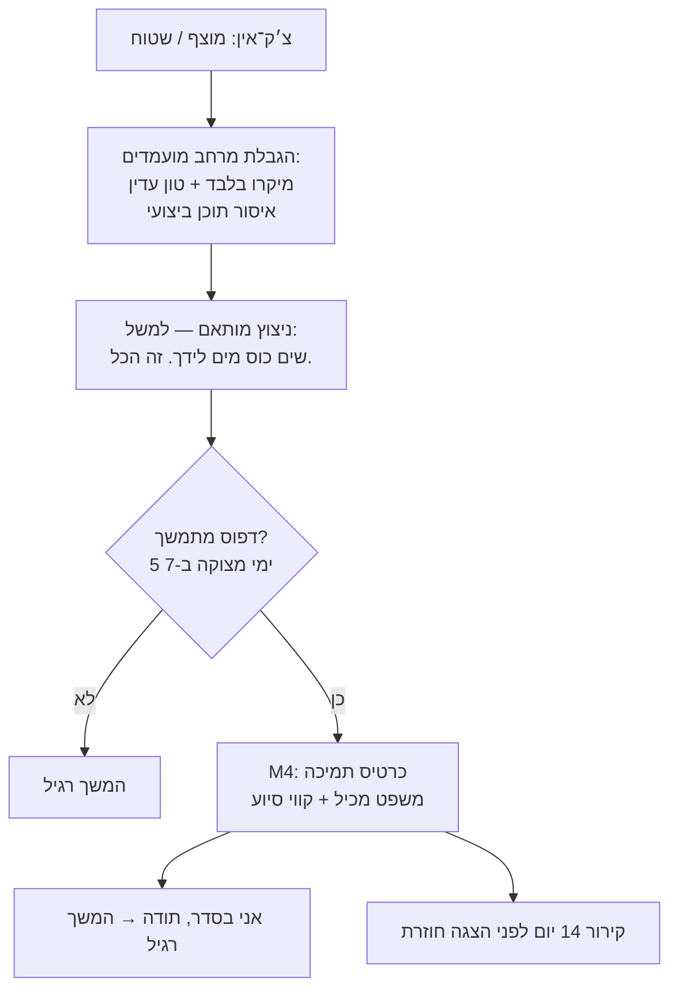

# 4. זרימות משתמש מלאות

---

## 4.1 זרימה 1 — First Run (מהתקנה לניצוץ ראשון)

**יעד:** ניצוץ ראשון בתוך 75 שניות, ללא חשבון וללא הרשאות.



### עקרונות תכנון קריטיים באונבורדינג

| עיקרון | יישום | למה |
|--------|-------|-----|
| **ערך לפני בקשה** | ניצוץ ראשון לפני הרשאת התראות ולפני חשבון | מכפיל שיעור אישור התראות ב‑1.8–2.4 בממוצע בתעשייה |
| **בקשת הרשאה בהקשר** | מסך הסבר משלנו לפני דיאלוג המערכת | דיאלוג המערכת ניתן לבקשה **פעם אחת** בלבד ב‑iOS |
| **אורח מלא** | כל הפיצ'רים עובדים ללא חשבון | חשבון הוא חיכוך; דוחים אותו ליום 3 בהודעה עדינה |
| **בחירה ולא הקלדה** | הכל בצ'יפים; מטרה חופשית אופציונלית | הקלדה במובייל = נשירה |
| **פס התקדמות** | 4 נקודות בראש | ודאות מפחיתה נטישה |
| **דילוג תמיד זמין** | בכל מסך | דילוג < נשירה. המנוע מתחיל מסגמנט ברירת מחדל |

### קריטריוני קבלה
- זמן חציוני מהתקנה לניצוץ ראשון ≤ 75 שניות.
- אחוז סיום אונבורדינג ≥ 78%.
- אם המשתמש דילג על הכל — עדיין מקבל ניצוץ תקין (מסגמנט "כללי · 5 דקות · פרקטי").

---

## 4.2 זרימה 2 — הלולאה היומית (הזרימה המרכזית)



**נקודת המפתח:** הלולאה נסגרת. כל תגובה חוזרת למנוע ומשפיעה על מחר.

### תזמון מדויק
| שעה (מקומית) | פעולה |
|--------------|-------|
| 03:00 | Job יומי: חישוב מועמדים + דירוג + ניסוח + שער בטיחות |
| 03:15 | Push scheduling לפי מודל זמן שליחה אישי |
| 04:00 | גבול היום הלוגי (לפני זה עדיין "אתמול") |
| שעה אישית (07:00–21:00) | שליחת ההתראה |
| 22:00 | אם לא נפתח — סימון `missed`, ללא התראה נוספת |

---

## 4.3 זרימה 3 — מהתראה לפעולה (המסלול המהיר)

```
התראה → [הקשה] → מסך הבית עם הניצוץ כבר חשוף → [✓ עשיתי] → סגירה
                                                     ↑
                                            3 הקשות · ~12 שניות
```

**קיצור דרך:** פעולות התראה מהירות (Notification Actions) — "עשיתי ✓" ו‑"מאוחר יותר"
ישירות מההתראה, ללא פתיחת האפליקציה. תומך ב‑iOS ו‑Android.

**Live Activity / Ongoing Notification (P1):** לניצוצות עם טיימר, פס התקדמות במסך הנעילה.

---

## 4.4 זרימה 4 — "לא בשבילי" (לולאת התיקון)



**עיקרון:** שתי דחיות ברצף = אות שהמודל טועה בכיוון, לא רק בפריט. עוברים משיפור הדרגתי לתיקון מפורש.

---

## 4.5 זרימה 5 — משתמש חוזר אחרי היעדרות

| משך היעדרות | התנהגות המערכת |
|-------------|-----------------|
| 1–2 ימים | שום דבר מיוחד. הניצוץ ממתין. **אין "התגעגענו"**. |
| 3–6 ימים | הרצף הוקפא אוטומטית (אם יש ימי הקפאה). הודעה בפתיחה: "הרצף שלך שמור." |
| 7–13 ימים | ניצוץ "חזרה רכה" — מיקרו, קל במיוחד, ללא אזכור ההיעדרות. התראת re‑engage אחת. |
| 14–29 ימים | מסך "ברוך שובך" קצר: "רוצה להמשיך מאיפה שהיית, או להתחיל מחדש?" |
| 30+ ימים | הצעת כוונון מחדש (2 שאלות) + איפוס עדין של סף החקירה במנוע (יותר exploration) |

**כלל מוחלט:** אף פעם לא שפה מאשימה. לא "לא ראינו אותך", לא "פספסת 12 ימים", לא אימוג'י עצוב.

---

## 4.6 זרימה 6 — שדרוג למנוי



**עיקרון אתי:** תזכורת לפני חיוב היא ברירת מחדל, לא הגדרה. זה מוריד ביטולי חיוב (chargebacks) ומעלה דירוגים.

---

## 4.7 זרימה 7 — יום קשה (מסלול בטיחות)



---

## 4.8 מפת חיכוכים ופתרונות

| חיכוך | איפה | פתרון |
|-------|------|-------|
| בקשת הרשאה מוקדמת מדי | אונבורדינג | אחרי הניצוץ הראשון + מסך priming משלנו |
| חובת הרשמה | אונבורדינג | מצב אורח מלא, חשבון ביום 3 |
| יותר מדי שאלות | אונבורדינג | 3 מסכי בחירה בלבד, כולם ניתנים לדילוג |
| "מה עכשיו?" | מסך הבית | הצעד תמיד מודגש ויזואלית כפעולה |
| שכחה | יומי | התראה בזמן אישי + ווידג׳ט + פעולות מהירות |
| תחושת כישלון | רצף | ימי הקפאה + שפה נטולת ענישה |
| תוכן שלא מתאים | יומי | reroll + "לא בשבילי" + לולאת תיקון |
| ביטול מנוי מסובך | מנוי | קישור ישיר לניהול מנוי במערכת ההפעלה |
